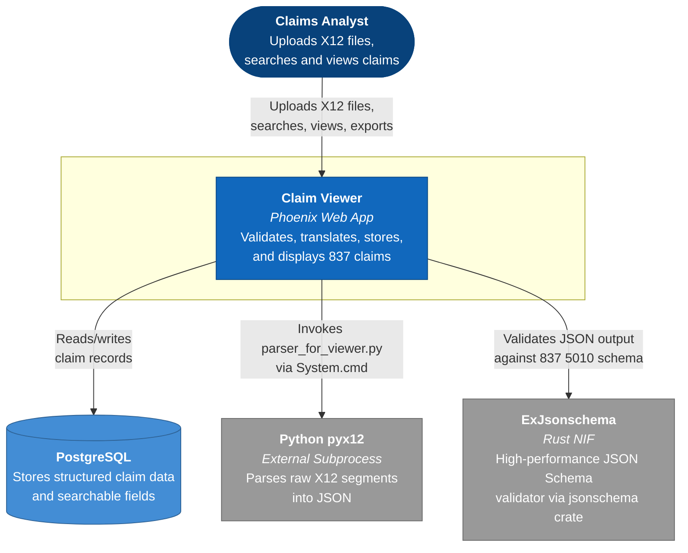
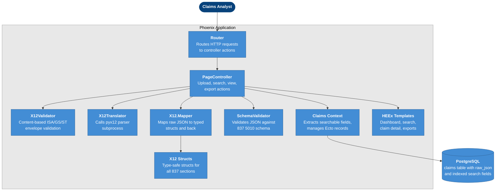
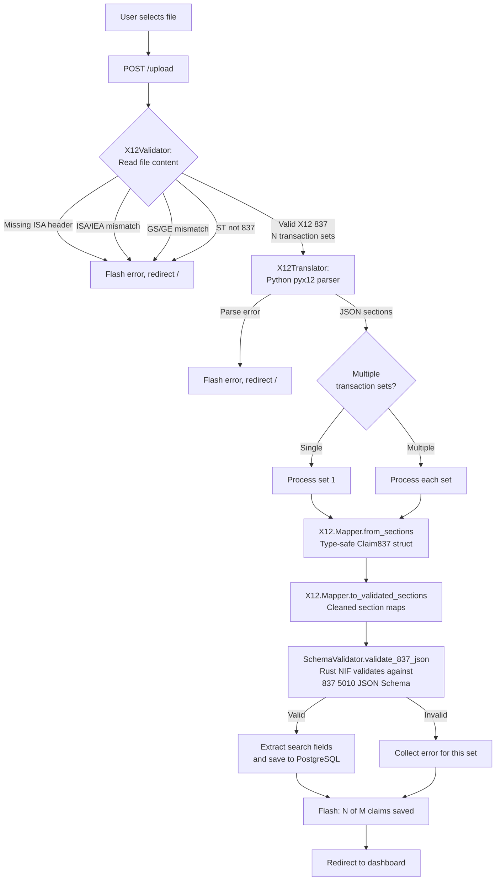
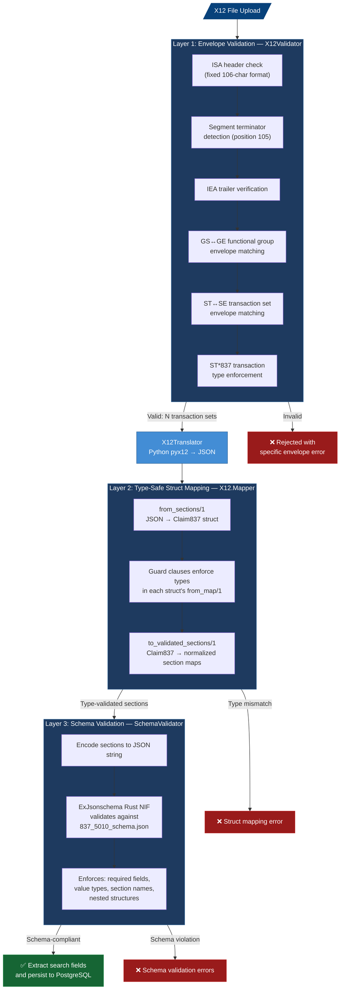
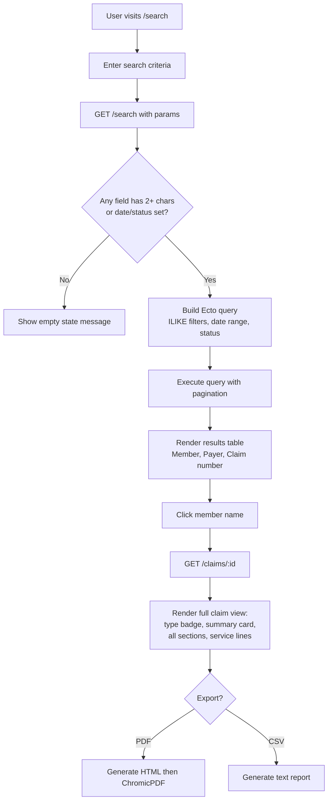
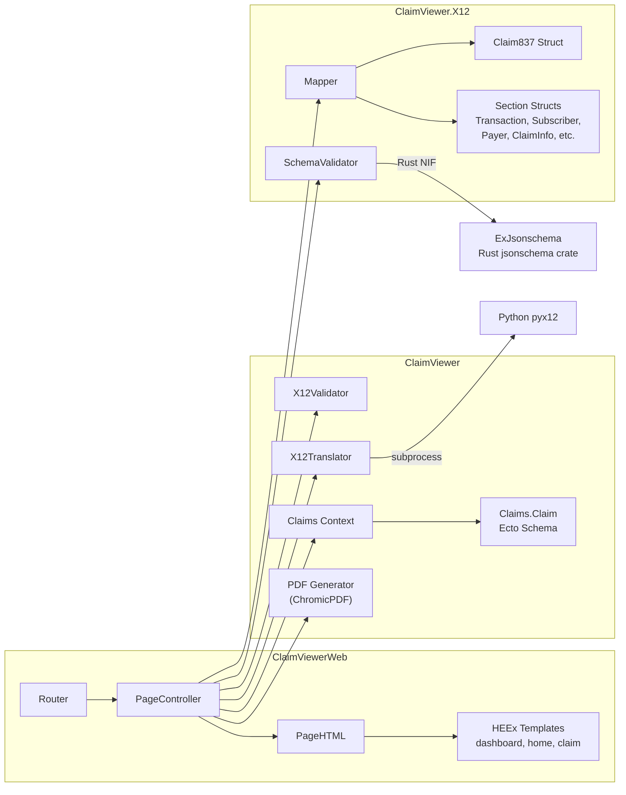

# Claim Viewer

A healthcare claims system that validates, translates, stores, and displays X12 837 EDI claim data through a Phoenix web application.

## Project Context

This application is part of the **X12 837 Translator and Claims Viewer Program**. The complete system translates EDI-formatted healthcare claims into JSON and provides a user-friendly web interface for viewing and searching claim data.

**Project Components:**
- **X12 to JSON Translation** — Python tool using the PyX12 library (separate component)
- **Claim Viewer** — This Phoenix/Elixir application for storing, searching, and displaying JSON claims with a structured user interface

## Features

✅ **X12 File Upload** — Upload any file; content is validated as X12 837 and automatically translated to JSON  
✅ **Content-Based Validation** — File extensions are irrelevant; ISA/IEA, GS/GE, and ST\*837/SE envelope structure is verified from raw file bytes  
✅ **Multi-Transaction-Set Support** — A single interchange containing multiple claims is split and each is validated independently  
✅ **Type-Safe Structs** — All 837 sections are mapped to enforced Elixir structs for data integrity  
✅ **JSON Schema Validation** — Rust-backed validator enforces HIPAA-compliant 837 5010 schema  
✅ **Persistent Storage** — PostgreSQL database storing both raw JSON and extracted searchable fields  
✅ **Advanced Multi-Criteria Search** — Search by member name, payer, providers, claim number, and service date range
✅ **Structured Display** — Clean, organized view of all claim sections in form-like layout (not raw JSON)  
✅ **Service Lines Table** — Dedicated table view for line-item charges with procedure codes, dates, and amounts  
✅ **Search Results Table** — Interactive results grid showing member, payer, and claim information
✅ **Modern Dark Theme UI** — Professional interface with cyan/green color scheme  
✅ **Case-Insensitive Search** — ILIKE queries for flexible text matching  
✅ **Date Range Filtering** — Filter claims by service date period  
✅ **Automatic Field Extraction** — Searchable fields automatically extracted from uploaded JSON

## Overview

Claim Viewer accepts any file containing valid X12 837 content — regardless of file extension — validates its envelope structure, translates each transaction set to structured JSON via a Python parser, enforces type safety through Elixir structs, validates the output against a HIPAA-compliant JSON Schema using a Rust-backed validator, and persists each claim to PostgreSQL for searching, viewing, and exporting.

A single X12 interchange can contain multiple transaction sets (claims). Each is individually validated and persisted.

## Architecture

### C4 Context Diagram



### C4 Container Diagram



### Upload and Validation Flow



### Validation Pipeline

The upload pipeline enforces data integrity through three sequential validation layers. Each layer targets a different class of errors, ensuring the JSON output faithfully represents the original X12 837 data. A claim must pass all three layers before it is persisted.



**Layer 1 — Envelope Validation** (`lib/claim_viewer/x12_validator.ex`)
Operates on raw file bytes before any parsing. Validates the X12 interchange envelope structure: ISA/IEA, GS/GE, and ST/SE pairs must be present and balanced. Every ST segment must declare transaction type `837`. Rejects non-X12 content and non-837 transaction types immediately.

**Layer 2 — Type-Safe Struct Mapping** (`lib/claim_viewer/x12/mapper.ex`)
After the Python parser produces JSON sections, each section is converted into a typed Elixir struct (`Claim837` containing `Transaction`, `Subscriber`, `Payer`, `ClaimInfo`, `ServiceLine`, etc.) via `from_sections/1`. Guard clauses in each struct's `from_map/1` enforce data types. The structs are then converted back to section maps via `to_validated_sections/1`, completing a round-trip that normalizes all values.

**Layer 3 — JSON Schema Validation** (`lib/claim_viewer/x12/schema_validator.ex`)
The normalized sections are validated against a HIPAA-compliant 837 5010 JSON Schema (`priv/schemas/837_5010_schema.json`) using the Rust-backed `ExJsonschema` library. The schema enforces required sections (e.g., `claim` must exist), required fields per section (e.g., `id` and `totalCharge` on claims), correct value types, allowed section names via enum constraint, and nested structures like addresses. The compiled schema is cached in `:persistent_term` for near-instant runtime validation.

All three layers are orchestrated by `process_single_transaction_set/2` in `PageController`. If any layer fails, that transaction set is rejected with a descriptive error while other sets in the same interchange can still succeed.

### Search and Display Flow



### Internal Module Map



## Requirements

- Elixir 1.19+
- Erlang/OTP 28+
- Phoenix Framework 1.8+
- PostgreSQL 17+
- Ecto
- Jason
- Python 3 with pyx12 library
- Rust toolchain (see [Rust-Backed JSON Schema Validation](#rust-backed-json-schema-validation) below for details)
- Google Chrome or Chromium (for PDF export via ChromicPDF)

## Getting Started

```bash
# Clone the repository
git clone <your-repository-url>
cd claim_viewer

# Install Python dependencies (required for X12 file processing)
python3 -m pip install pyx12

# macOS note:
# If python3/pip is missing, install Python 3 (e.g., `brew install python` or from python.org),
# then run the command above again.

# Install dependencies
mix deps.get

# Change UName to your user name
export PGUSER=UName

# Change PWD to your password
export PGPASSWORD=PWD

# Set the port to 5432
export PGPORT=5432

# Create and migrate database
mix ecto.create
mix ecto.migrate

# Start Phoenix server
mix phx.server

# Or use the setup alias (installs deps, creates DB, runs migrations, builds assets)
mix setup

# Start inside IEx (interactive Elixir shell)
iex -S mix phx.server
```

Visit **http://localhost:4000** in your browser.

## Usage

### Uploading Claims

The application accepts **any file** as long as its content is a valid X12 837 interchange. **File extensions are irrelevant** — the system reads the raw file bytes and validates the X12 envelope structure (ISA/IEA, GS/GE, ST\*837/SE) before processing.

Click "Upload X12 Claim File" and select your file. The upload pipeline then:

1. **Validates** the file content is a well-formed X12 837 interchange
2. **Translates** the X12 segments to structured JSON via the Python pyx12 parser
3. **Maps** the JSON into type-safe Elixir structs for data integrity
4. **Validates** the resulting JSON against a HIPAA-compliant 837 5010 JSON Schema (Rust-backed)
5. **Persists** each valid claim to PostgreSQL with extracted searchable fields

If the interchange contains multiple transaction sets, each is processed and validated independently. The flash message reports how many succeeded vs. failed (e.g., "3 of 4 claims saved").

> **Note:** JSON is used internally as an intermediate format for storage and processing. Users should upload X12 files, not JSON files.

### Searching Claims

The search form supports multiple criteria that can be used individually or combined:

- **Member first name** — Partial match, case-insensitive
- **Member last name** — Partial match, case-insensitive
- **Payer name** — Insurance company name search
- **Billing provider** — Provider organization name
- **Rendering provider NPI** — Individual provider NPI number
- **Claim #** — Clearinghouse claim number
- **Service date range** — Filter by date range (from date and to date)

Click **Search** to view matching results or **Clear** to reset all fields.

### Viewing Claim Details

Search results are displayed in a table with member name, payer, and claim number. Click any member name to view the full claim, which displays data in a structured layout with sections:

- **Transaction** — Control number, date, purpose, reference ID, time, type, version
- **Submitter** — Contact information, ID, name
- **Receiver** — ID and name
- **Billing Provider** — Address, name, tax ID
- **Pay-To Provider** — Address, name, tax ID
- **Subscriber** — Member address, DOB, name, group number, ID, plan type, relationship, sex
- **Payer** — Payer name and payer ID
- **Claim** — Clearinghouse claim number, ID, indicators, onset date, place of service, service type, total charge
- **Diagnosis** — Primary and secondary diagnosis codes
- **Rendering Provider** — First name, last name, NPI
- **Service Facility** — Address, name, tax ID
- **Service Lines** — Table with charge, code qualifier, diagnosis pointer, emergency indicator, line number, procedure code, service date, unit qualifier, and units

### Exporting Claims

- **PDF** — Full claim report generated via ChromicPDF (Chrome headless)
- **CSV** — Human-readable text report with all sections

## Routes

| Method | Path | Action | Description |
|--------|------|--------|-------------|
| `GET` | `/` | `dashboard` | Dashboard with aggregate statistics |
| `GET` | `/search` | `home` | Search form and paginated results |
| `GET` | `/claims/:id` | `show` | Full claim detail view |
| `GET` | `/claims/:id/export` | `export_pdf` | Download claim as PDF |
| `GET` | `/claims/:id/export/csv` | `export_csv` | Download claim as text report |
| `POST` | `/upload` | `upload` | Upload and process X12 file |

## Database Schema

### Claims Table

The `claims` table stores complete claim information:

```elixir
schema "claims" do
  field :raw_json, {:array, :map}          # Complete JSON claim data

  # Searchable fields automatically extracted during upload
  field :member_first_name, :string
  field :member_last_name, :string
  field :member_dob, :date
  field :payer_name, :string
  field :billing_provider_name, :string
  field :billing_provider_npi, :string
  field :pay_to_provider_name, :string
  field :pay_to_provider_npi, :string
  field :rendering_provider_name, :string
  field :rendering_provider_npi, :string
  field :clearinghouse_claim_number, :string
  field :date_of_service, :date

  timestamps()
end
```

### Migrations

1. **create_claims** — Initial claims table with `raw_json` field
2. **add_search_fields_to_claims** — Adds searchable text fields
3. **add_date_of_service_to_claims** — Adds date filtering capability

## Project Structure

```
lib/
├── claim_viewer/
│   ├── claims.ex                          # Context module for field extraction
│   ├── claims/
│   │   └── claim.ex                       # Ecto schema definition
│   ├── x12_validator.ex                   # Content-based X12 837 file validation
│   ├── x12_translator.ex                  # Calls Python pyx12 parser subprocess
│   ├── pdf.ex                             # PDF generation wrapper
│   └── x12/
│       ├── claim837.ex                    # Top-level Claim837 struct
│       ├── mapper.ex                      # Maps raw JSON ↔ typed structs
│       ├── schema_validator.ex            # Rust-backed 837 JSON Schema validation
│       ├── address.ex                     # Address struct
│       ├── billing_provider.ex            # BillingProvider struct
│       ├── claim_info.ex                  # ClaimInfo struct
│       ├── diagnosis.ex                   # Diagnosis struct
│       ├── pay_to_provider.ex             # PayToProvider struct
│       ├── payer.ex                       # Payer struct
│       ├── receiver.ex                    # Receiver struct
│       ├── rendering_provider.ex          # RenderingProvider struct
│       ├── service_facility.ex            # ServiceFacility struct
│       ├── service_line.ex                # ServiceLine struct
│       ├── submitter.ex                   # Submitter struct
│       ├── subscriber.ex                  # Subscriber struct
│       └── transaction.ex                 # Transaction struct
├── claim_viewer_web/
│   ├── controllers/
│   │   ├── page_controller.ex             # Handles upload, search, and display
│   │   ├── page_html.ex                   # Helper functions
│   │   └── page_html/
│   │       ├── dashboard.html.heex        # Dashboard statistics
│   │       ├── home.html.heex             # Main UI with search form and results
│   │       └── claim.html.heex            # Individual claim detail view
priv/
├── python/
│   └── parser_for_viewer.py               # Python X12-to-JSON parser
├── schemas/
│   └── 837_5010_schema.json               # HIPAA-compliant 837 JSON Schema
└── repo/
    └── migrations/
        ├── *_create_claims.exs
        ├── *_add_search_fields_to_claims.exs
        └── *_add_date_of_service_to_claims.exs
```

## Technical Details

### Field Extraction

The `Claims` context module extracts searchable fields from the nested JSON structure during upload:

```elixir
def extract_search_fields(sections) do
  %{
    member_first_name: get_in_section(sections, "subscriber", ["firstName"]),
    member_last_name: get_in_section(sections, "subscriber", ["lastName"]),
    member_dob: get_in_section(sections, "subscriber", ["dob"]),
    payer_name: get_in_section(sections, "payer", ["name"]),
    # ... additional fields
  }
end
```

### Dynamic Query Building

Search queries are built dynamically based on which fields have values:

```elixir
defp maybe_like(query, _field, ""), do: query
defp maybe_like(query, field, value) do
  where(query, [c], ilike(field(c, ^field), ^"%#{value}%"))
end
```

### Rust-Backed JSON Schema Validation

The application uses [`ex_jsonschema`](https://hex.pm/packages/ex_jsonschema) for JSON Schema validation. Under the hood, `ex_jsonschema` is a **Native Implemented Function (NIF)** — it wraps the Rust [`jsonschema`](https://crates.io/crates/jsonschema) crate and compiles it into a shared library that the BEAM loads directly into its process space.

**What the Rust toolchain does:**
- The Rust compiler (`rustc`) and its package manager (`cargo`) compile the `jsonschema` crate and its transitive dependencies into a native shared library (`.so` on Linux, `.dylib` on macOS) during `mix deps.compile`.
- This compiled NIF is loaded by the BEAM at application startup, giving Elixir code direct, zero-overhead access to the Rust validation engine.

**Why this matters for performance:**
- **Native speed** — JSON Schema validation runs as compiled machine code inside the BEAM process, not as interpreted Elixir. For complex schemas like HIPAA 837 5010, this is orders of magnitude faster than a pure-Elixir validator.
- **Schema compiled once** — The JSON Schema is parsed and compiled into an optimized in-memory representation once at startup (cached via `:persistent_term`). Every subsequent validation call reuses this compiled schema, avoiding repeated parsing.
- **No subprocess overhead** — Unlike the Python pyx12 parser (which spawns an OS process via `System.cmd`), the Rust NIF runs in-process with no serialization, no IPC, and no process creation cost.

**Do you need Rust installed?**
- **Usually no.** The `ex_jsonschema` library ships with precompiled binaries for common platforms (macOS arm64/x86_64, Linux x86_64). When you run `mix deps.get`, the precompiled NIF is downloaded automatically.
- **Only if** no precompiled binary exists for your platform will `mix deps.compile` attempt to compile from source, which requires `rustc` and `cargo` (install via [rustup.rs](https://rustup.rs)).

## Technology Stack

- **Web framework:** Phoenix 1.8+
- **Language:** Elixir 1.19+ on Erlang/OTP 28+
- **Database:** PostgreSQL via Ecto
- **X12 parsing:** Python `pyx12` library (called as subprocess)
- **JSON Schema validation:** `ex_jsonschema` (Rust NIF via `jsonschema` crate)
- **PDF generation:** `chromic_pdf` using Chrome headless (DevTools Protocol)
- **Frontend:** Server-rendered HEEx templates with Tailwind CSS dark theme
- **No external UI libraries** — Pure HTML/Elixir templates without JavaScript frameworks

## Development

### Environment Variables

| Variable | Default | Purpose |
|---|---|---|
| `PGUSER` | `postgres` | Database username |
| `PGPASSWORD` | `postgres` | Database password |
| `PGHOST` | `localhost` | Database host |
| `PGPORT` | `5432` | Database port |
| `PGDATABASE` | `claim_viewer_dev` | Database name |
| `PORT` | `4000` | HTTP server port |

### Running Tests

```bash
mix test
```

### Pre-commit Check

Runs compile (warnings-as-errors), unused deps check, formatting, and tests:

```bash
mix precommit
```

## Contributors

<ol type="I">
  <li><b>Irini Gega</b></li>
  <li><b>Le Luo</b></li>
  <li><b>Charles E. O'Riley Jr.</b></li>
  <li><b>Don Fox</b></li>
  <li><b>Verbus M. Counts</b></li>
</ol>

## Acknowledgments

Special thanks to the team working on the X12 837 Translator and Claims Viewer Program for their collaboration and support.
 