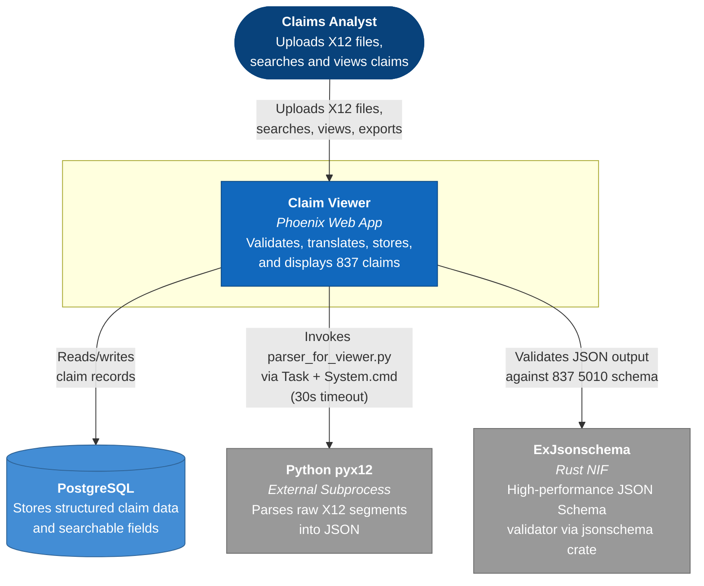
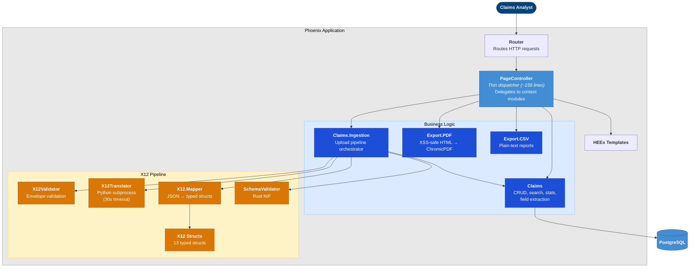
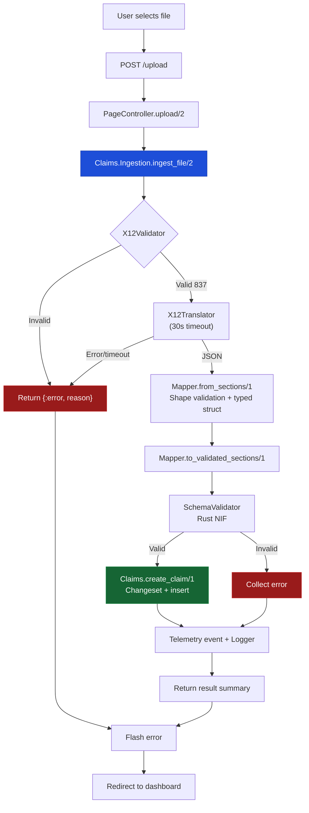
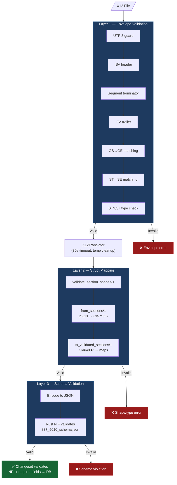
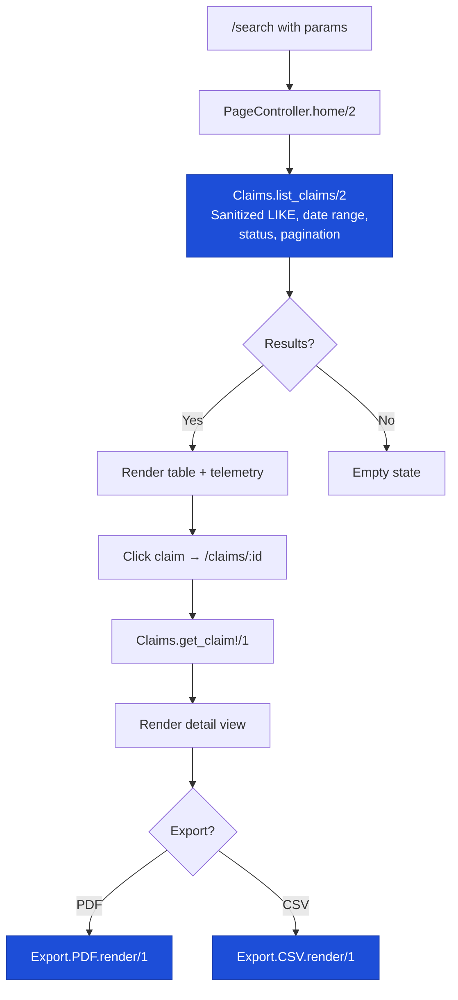
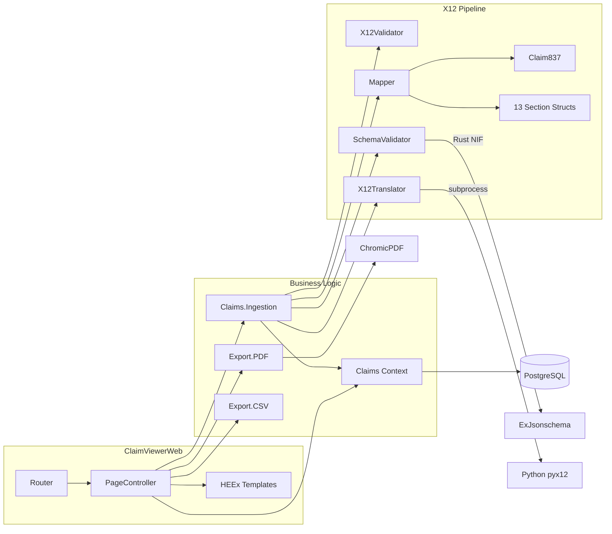

# Claim Viewer

A HIPAA-aware healthcare claims system that validates, translates, stores, and displays X12 837 EDI claim data through a Phoenix web application. Built with a layered validation pipeline, comprehensive property-based testing, and production-grade observability.

## Purpose

The U.S. healthcare industry transmits billions of dollars in claims using the X12 837 EDI format — a dense, segment-based wire format that is not human-readable. **Claim Viewer** bridges this gap: it accepts raw X12 837 files, validates their envelope structure, translates them into structured JSON through a three-layer integrity pipeline, and presents the data through a searchable, exportable web interface.

The application is part of the **X12 837 Translator and Claims Viewer Program**:

- **X12 to JSON Translation** — Python tool using the PyX12 library (separate component)
- **Claim Viewer** — This Phoenix/Elixir application for ingesting, storing, searching, and displaying claims

## How to Run

### Requirements

- Elixir 1.19+ / Erlang/OTP 28+
- PostgreSQL 17+
- Python 3 with the `pyx12` library
- Google Chrome or Chromium (for PDF export)

### Setup

```bash
cd claim_viewer

# Install Python X12 parser dependency
python3 -m pip install pyx12

# Install Elixir dependencies
mix deps.get

# Configure database (adjust to your credentials)
export PGUSER=<your_username>
export PGPASSWORD=<your_password>
export PGPORT=5432

# Create database, run migrations, install assets
mix setup

# Start the server
iex -S mix phx.server
```

Visit **http://localhost:4000**.

### Environment Variables

| Variable | Default | Purpose |
|---|---|---|
| `PGUSER` | `postgres` | Database username |
| `PGPASSWORD` | `postgres` | Database password |
| `PGHOST` | `localhost` | Database host |
| `PGPORT` | `5432` | Database port |
| `PGDATABASE` | `claim_viewer_dev` | Database name |
| `PORT` | `4000` | HTTP server port |

## Features

### X12 File Upload

Accepts **any file** as long as its content is a valid X12 837 interchange — file extensions are irrelevant. The system reads the raw bytes and validates the X12 envelope structure (ISA/IEA, GS/GE, ST\*837/SE) before processing. A single interchange containing multiple transaction sets (claims) is split and each is validated independently. The flash message reports how many succeeded vs. failed.

### Three-Layer Validation Pipeline

Every uploaded claim passes through three sequential validation layers before it is persisted. This ensures the stored JSON faithfully represents the original X12 data.

1. **Envelope Validation** — Rejects corrupted binaries (non-UTF-8), validates ISA/IEA, GS/GE, and ST/SE envelope pairs, and enforces transaction type `837`.
2. **Type-Safe Struct Mapping** — Validates the shape of each JSON section, converts them into typed Elixir structs (`Claim837` with 13 sub-structs), and round-trips back to normalized maps. Property tests verify this round-trip is lossless.
3. **JSON Schema Validation** — A Rust-backed NIF (`ExJsonschema`) validates the normalized JSON against a HIPAA-compliant 837 5010 schema. The compiled schema is cached in `:persistent_term` for near-instant validation.

### Ingestion Pipeline

The `Claims.Ingestion` module orchestrates the full upload workflow — validate, translate, map, schema-validate, save — with no controller dependency. It can be called from IEx, background jobs, or tests. The Python subprocess runs inside a `Task` with a 30-second hard timeout and guaranteed temp file cleanup.

### Dashboard

Aggregate statistics (total claims, approved/pending counts, approved revenue, claims older than 30 days, this month's count) computed entirely with SQL aggregates — no claims are loaded into memory.

### Multi-Criteria Search

Search by member name, payer, billing provider, rendering provider NPI, claim number, service date range, and approval status. All text searches use case-insensitive `ILIKE` with LIKE wildcard characters (`%`, `_`, `\`) escaped to prevent injection. Filters compose conjunctively — adding more filters never increases results.

### Claim Detail View

Displays all 12 sections of an 837 claim in a structured layout: Transaction, Submitter, Receiver, Billing Provider, Pay-To Provider, Subscriber, Payer, Claim, Diagnosis, Rendering Provider, Service Facility, and Service Lines (tabular).

### PDF and CSV Export

- **PDF** — Full claim report rendered as styled HTML with all interpolated values HTML-escaped via `Plug.HTML.html_escape_to_iodata/1` to prevent XSS, then converted to PDF via ChromicPDF.
- **CSV** — Human-readable plain-text report with all sections, formatted dates, and status determination.

### Changeset Validations

The `Claim` Ecto schema enforces `raw_json` as required and validates NPI fields (`billing_provider_npi`, `rendering_provider_npi`) against a strict 10-digit format. Invalid data never reaches the database.

### Telemetry and Observability

`:telemetry` events are emitted for ingestion, export (PDF/CSV), and search operations. Metrics are wired to `ClaimViewerWeb.Telemetry` for LiveDashboard visibility at `/dev/dashboard` in development.

### Property-Based Testing

69 properties across 7 test files using `stream_data` with custom generators that produce realistic X12 data, XSS payloads, SQL wildcard injections, and corrupted binaries. The critical HIPAA invariant — **every field in every section survives the JSON→struct→JSON pipeline without mutation** — is verified field-by-field across hundreds of generated claims.

## Architecture

### C4 Context Diagram



### C4 Container Diagram



### Upload and Ingestion Flow



### Validation Pipeline



### Search and Display Flow



### Internal Module Map



## Testing

### Running Tests

```bash
# Full suite: 58 unit tests + 69 property-based tests
mix test

# Verbose output
mix test --trace

# Pre-commit check (compile warnings-as-errors + format + test)
mix precommit
```

### Property-Based Tests

Unlike traditional unit tests that verify a handful of hand-picked examples, property-based tests generate **hundreds of randomized inputs** per property and verify that an invariant holds for every one. This is critical for HIPAA compliance — it's not enough to test one NPI; the system must reject *every* malformed NPI and accept *every* valid one.

The property tests use the [`stream_data`](https://hex.pm/packages/stream_data) library. Custom generators in `test/support/generators.ex` produce:

- **Realistic X12 data** — complete 12-section claim payloads with valid NPIs, ICD-10 codes, addresses, service lines, and indicators
- **XSS payloads** — `<script>alert('PHI')</script>`, `<iframe>`, ``, event handler injections
- **SQL wildcard injections** — `%`, `_`, `\`, and combined patterns like `%' OR '1'='1`
- **Boundary values** — empty strings, `nil`, extra/missing map keys, non-UTF-8 binary data
- **Invalid NPIs** — wrong lengths, non-digit characters, special characters

Each property runs 100–500 iterations by default (configurable via `max_runs` in the test source).

#### Running the property tests

```bash
# Run all 7 property test files (69 properties)
mix test test/claim_viewer/properties/

# Run a specific test file
mix test test/claim_viewer/properties/pipeline_fidelity_properties_test.exs

# Run with verbose output to see each property name
mix test test/claim_viewer/properties/ --trace

# Use a fixed seed so a failing run can be reproduced exactly
mix test test/claim_viewer/properties/ --seed 12345

# Run only the property tests alongside the full pre-commit check
mix precommit
```

When a property fails, `stream_data` automatically **shrinks** the failing input to the smallest example that still triggers the failure, making it easy to diagnose. The output shows the generated value that caused the failure.

#### Property test coverage

| Test File | Properties | What It Verifies |
|-----------|:----------:|------------------|
| `x12_struct_properties_test.exs` | 28 | Round-trip idempotency for all 13 structs, nil tolerance, fuzz robustness with extra/missing keys |
| `mapper_properties_test.exs` | 7 | Section ordering independence, unknown section tolerance, malformed input always rejected |
| `claim_changeset_properties_test.exs` | 6 | Valid NPIs always accepted, invalid NPIs always rejected, fuzz attrs never crash, valid fuzz insertable |
| `export_properties_test.exs` | 7 | No unescaped `<` `>` `"` in HTML output, XSS payloads neutralized, CSV never crashes on any input |
| `claims_context_properties_test.exs` | 5 | LIKE wildcards `%`/`_` never match unrelated claims, adding filters never increases results, fuzz filters safe |
| `x12_validator_properties_test.exs` | 3 | Random binary fuzz (0–1000 bytes) never crashes, truncated ISA content safe, missing files handled |
| `pipeline_fidelity_properties_test.exs` | 13 | **Every field in every section survives the JSON→struct→JSON pipeline without mutation** — the critical HIPAA no-PHI-loss invariant |

## Routes

| Method | Path | Action | Description |
|--------|------|--------|-------------|
| `GET` | `/` | `dashboard` | Dashboard with SQL aggregate statistics |
| `GET` | `/search` | `home` | Search form and paginated results |
| `GET` | `/claims/:id` | `show` | Full claim detail view |
| `GET` | `/claims/:id/export` | `export_pdf` | Download claim as PDF |
| `GET` | `/claims/:id/export/csv` | `export_csv` | Download claim as text report |
| `POST` | `/upload` | `upload` | Upload and process X12 file |

## Technology Stack

- **Language:** Elixir 1.19+ on Erlang/OTP 28+
- **Web framework:** Phoenix 1.8+ with server-rendered HEEx templates
- **Database:** PostgreSQL via Ecto
- **X12 parsing:** Python `pyx12` (subprocess with 30s timeout)
- **JSON Schema:** `ex_jsonschema` (Rust NIF via `jsonschema` crate)
- **PDF generation:** `chromic_pdf` (Chrome headless via DevTools Protocol)
- **Property testing:** `stream_data` with HIPAA-focused generators
- **Frontend:** Tailwind CSS dark theme

## Contributors

<ol type="I">
  <li><b>Irini Gega</b></li>
  <li><b>Le Luo</b></li>
  <li><b>Charles E. O'Riley Jr.</b></li>
  <li><b>Don Fox</b></li>
  <li><b>Verbus M. Counts</b></li>
</ol>

## Acknowledgments

Special thanks to the team working on the X12 837 Translator and Claims Viewer Program for their collaboration and support.
