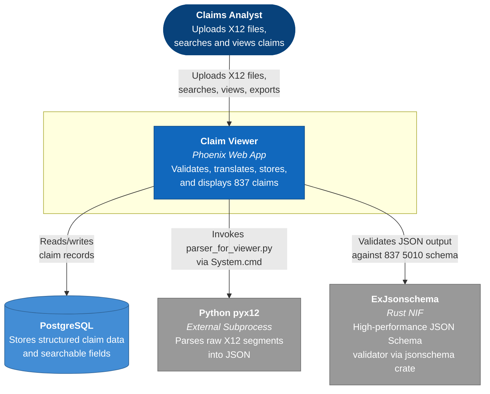
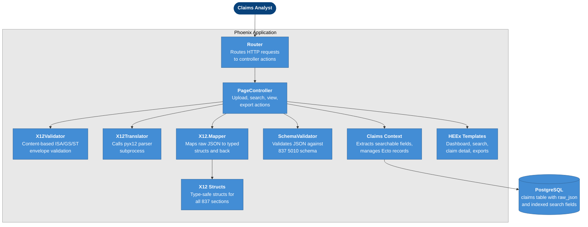
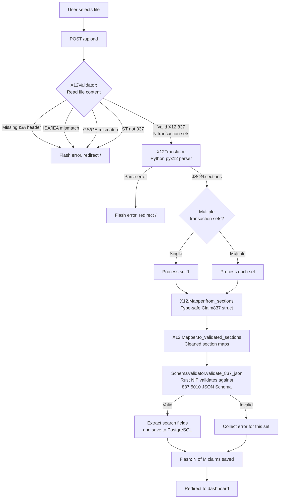
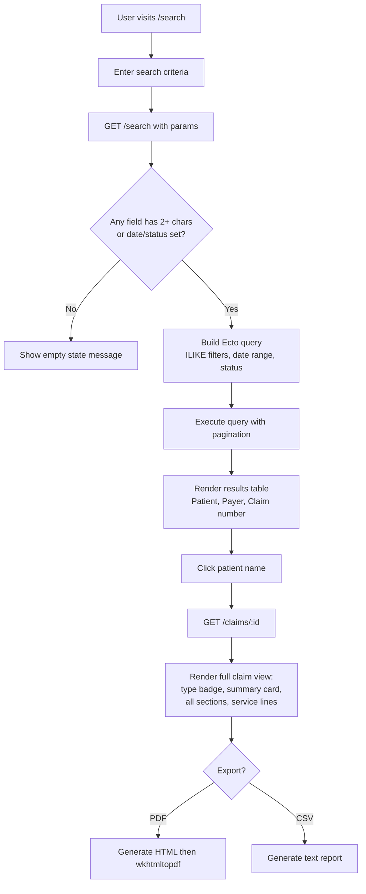
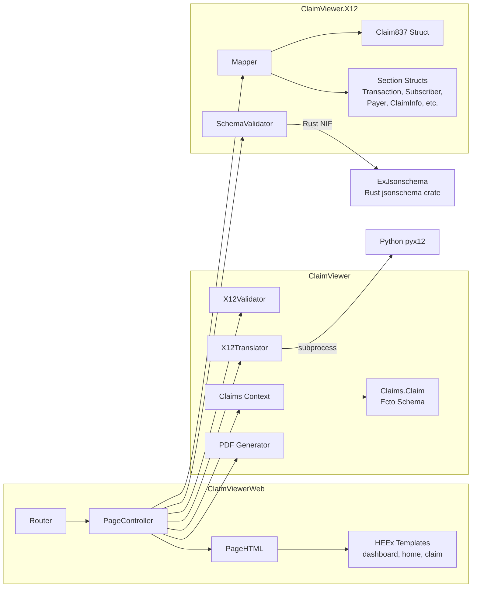

# Claim Viewer

A healthcare claims system that validates, translates, stores, and displays X12 837 EDI claim data through a Phoenix web application.

## Overview

Claim Viewer accepts any file containing valid X12 837 content — regardless of file extension — validates its envelope structure, translates each transaction set to structured JSON via a Python parser, enforces type safety through Elixir structs, validates the output against a HIPAA-compliant JSON Schema using a Rust-backed validator, and persists each claim to PostgreSQL for searching, viewing, and exporting.

A single X12 interchange can contain multiple transaction sets (claims). Each is individually validated and persisted.

## Architecture

### C4 Context Diagram



### C4 Container Diagram



### Upload and Validation Flow



### Search and Display Flow



### Internal Module Map



## Getting Started

### Prerequisites

- **Elixir** ~> 1.15 and **Erlang/OTP** (compatible version)
- **PostgreSQL** running on localhost:5432 (or configure via environment variables)
- **Python 3** with the `pyx12` library installed (`pip3 install pyx12`)
- **Rust toolchain** (for compiling the `ex_jsonschema` NIF, or precompiled binaries will be used automatically)
- **wkhtmltopdf** (optional, for PDF export)

### Setup

```bash
# Install dependencies, create DB, run migrations, build assets
mix setup

# Start the server
mix phx.server

# Or start inside IEx
iex -S mix phx.server
```

Visit [localhost:4000](http://localhost:4000) in your browser.

### Environment Variables (optional)

| Variable | Default | Purpose |
|---|---|---|
| `PGUSER` | `postgres` | Database username |
| `PGPASSWORD` | `postgres` | Database password |
| `PGHOST` | `localhost` | Database host |
| `PGPORT` | `5432` | Database port |
| `PGDATABASE` | `claim_viewer_dev` | Database name |
| `PORT` | `4000` | HTTP server port |

### Running Tests

```bash
mix test
```

### Pre-commit Check

Runs compile (warnings-as-errors), unused deps check, formatting, and tests:

```bash
mix precommit
```

## Upload Pipeline (Detail)

1. **File extension is ignored.** Any file is accepted for upload regardless of its name or extension.
2. **Content validation** (`X12Validator`): The raw file bytes are inspected for:
   - ISA interchange header (fixed 106-character format)
   - Segment terminator auto-detection from ISA position 105
   - IEA interchange trailer
   - GS/GE functional group envelope(s)
   - Every ST segment must be `ST*837` (non-837 types are rejected)
   - ST/SE pairs must be balanced
3. **Translation** (`X12Translator`): The Python `pyx12` library parses the raw X12 segments into a structured JSON array of section objects.
4. **Struct mapping** (`X12.Mapper`): Raw JSON maps are converted into type-safe Elixir structs (`Claim837`, containing `Transaction`, `Subscriber`, `Payer`, `ClaimInfo`, `ServiceLine`, etc.). Guard clauses in each struct's `from_map/1` enforce data types.
5. **Round-trip** (`X12.Mapper.to_validated_sections/1`): Structs are converted back to the section-map format, ensuring all values have been normalized.
6. **Schema validation** (`X12.SchemaValidator`): The JSON is validated against a HIPAA-compliant 837 5010 JSON Schema (`priv/schemas/837_5010_schema.json`) using the Rust-backed `ExJsonschema` library. The schema is compiled once via `:persistent_term` for near-instant runtime validation.
7. **Persistence**: Searchable fields (patient name, payer, NPI, etc.) are extracted and stored alongside the full `raw_json` in PostgreSQL.

If the interchange contains multiple transaction sets, each is processed independently. The flash message reports how many succeeded vs. failed.

## Route Map

| Method | Path | Action | Purpose |
|---|---|---|---|
| `GET` | `/` | `dashboard` | Dashboard with aggregate statistics |
| `GET` | `/search` | `home` | Search form + paginated results |
| `GET` | `/claims/:id` | `show` | Full claim detail view |
| `GET` | `/claims/:id/export` | `export_pdf` | Download claim as PDF |
| `GET` | `/claims/:id/export/csv` | `export_csv` | Download claim as text report |
| `POST` | `/upload` | `upload` | Upload and process X12 file |

## Technology Stack

- **Web framework:** Phoenix 1.8+
- **Language:** Elixir 1.15+ on Erlang/OTP
- **Database:** PostgreSQL via Ecto
- **X12 parsing:** Python `pyx12` library (called as subprocess)
- **JSON Schema validation:** `ex_jsonschema` (Rust NIF via `jsonschema` crate)
- **PDF generation:** `pdf_generator` wrapping `wkhtmltopdf` (optional)
- **Frontend:** Server-rendered HEEx templates with dark theme
